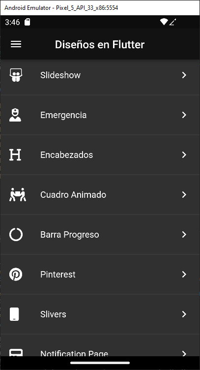
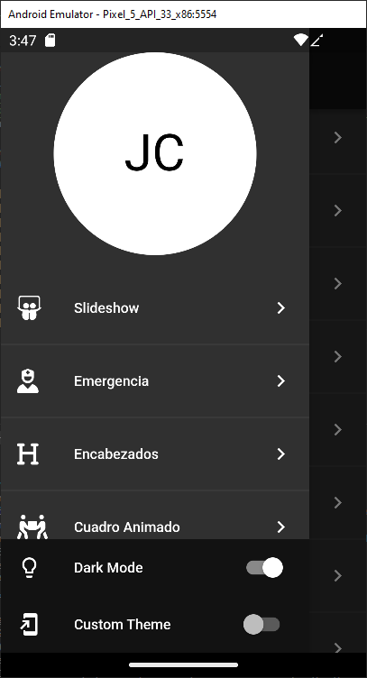
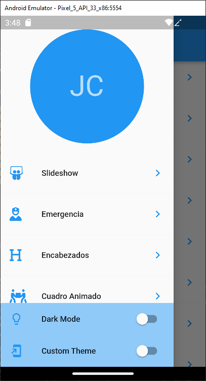
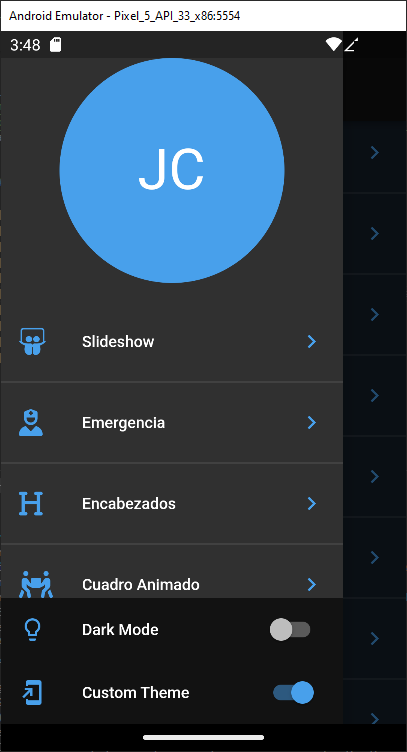
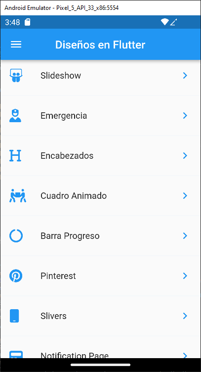
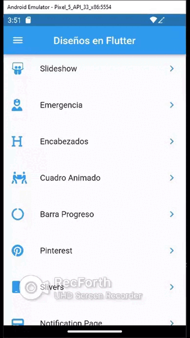

# h_theme_dark_light
<!-- https://en.wikipedia.org/wiki/Markdown -->
<!-- https://docs.github.com/en/repositories/managing-your-repositorys-settings-and-features/customizing-your-repository/about-readmes  -->
Disenos para manejar los temas Dark y Light de las Aplicaciones Flutter

## Appearance Application

 

